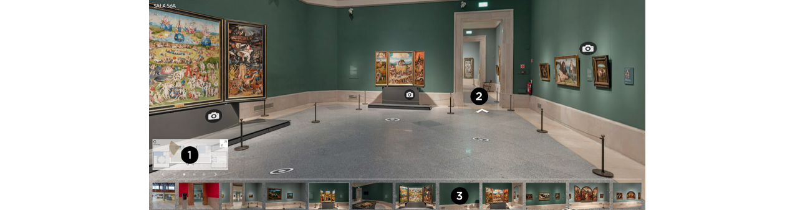

#### Pec3_Manovich_Reload

## LAS GAFAS DE MANOVICH: HIBRIDACIÓN
Ensayo sobre hibridación realizado para la asignatura de Cultura Digital, de la UOC
#### CRISTINA GIL TORAL
###### 17/12/2024

___

### ADAPTACIÓN DEL MUNDO ANTIGUO AL MUNDO DIGITAL

En el libro “El software toma el mando”, _Lev Manovich_ nos analiza el software como una hibridación de medios con ADN propio. Para alguien que solo ha conocido la actual tecnología, tales definiciones resultan ambiguas, puesto que hoy en día, todo es hibridación en mayor o menor medida, utilizamos estos nuevos medios e interactuamos con ellos sin ser conscientes de ello. Para poder entender el pensamiento de Manovich, antes es necesario saber que es un medio. 

#### ¿Cuál es la definición de “medio”? 
Decimos que, los medios son una representación digital o simulación de elementos “antiguos” (no por ello obsoletos, aunque sí relevados por practicidad). Manovich se refiere a este proceso como la **remediación de medios**

> Los nuevos medios son simulaciones de medios físicos
> previos ampliados con nuevas propiedades (_Manovich_)

Los nuevos medios se caracterizan por disponer de una serie de propiedades comunes que la **softwarización** del medio antiguo ha hecho posible, ello ha propiciado que los nuevos medios coexistan en conjunto como un único medio. A este proceso se le denomina **multimedia**.

> Definimos multimedia como la suma de medios convergiendo en un medio,
> en que cada medio conservaría su esencia, su lenguaje, y su modo de
> organizar y acceder a los datos

Sin embargo, los medios han seguido evolucionando e interactuando entre ellos hasta dar lugar a la **hibridación**. Este proceso consiste en un intercambio de técnicas y propiedades, fusionándose los medios entre ellos, mutando en la creación de nuevos medios, en que la estructura original de los datos se vería afectada.

> Para distinguir entre la _**multimedia**_ y los _**medios
> híbridos**_ hay que fijarse en si la estructura original de los datos se
> ve afectada o no cuando se combinan varios medios (_Manovich_)

¿Y como podríamos saber si estamos ante una hibridación de medios o un caso de multimedia?

> ...convivimos con multitud de
> ejemplo de híbridos de medios: los encontramos en las interfaces de
> usuario, las aplicaciones web, las apps móviles, el diseño vsual, el
> diseño intercativo, los efectos visuales, los medios locativos, los
> etornos interactivos, el arte digital y otros ámbitos de la cultura
> digital (_Manovich_)

A continuación vamos a analizar dos casos de hibridación.

___
### Visita Virtual al Museo del Prado (fotografía 360º)
[Visitas virtuales - Museo Nacional del Prado](https://www.museodelprado.es/visitas-virtuales)  

    

La digitalización de los museos españoles se llevó a cabo en el año 2022. Este proceso consiste en la toma de fotografías de alta resolución, que conserva hasta el mínimo detalle, permitiendo a los visitantes realizar visitas libres por sus galerías y explorar las obras, con super-zoom, como no sería posible hacerlo de forma presencial. El objetivo es ofrecer al visitante una experiencia interactiva y para ello confluyen diferentes tecnologías en el proceso. Pero antes de enfocarnos en la parte tecnológica, primero cabe definir **¿Qué es una visita virtual?** Se trata de la recreación de un entorno que ha sido diseñado con distintas tecnologías y permite al visitante recorrer un espacio e interactuar con los elementos que han sido incluidos, pudiendo acceder a información específica de estos en distintos formatos (audios, videos, texto). 

La **fotografía panorámica 360º** es la base de este proceso, y es la que permite al usuario observar las obras y su disposición en la salas como si se hallase _in situ_. Este resultado se consigue capturando un objeto desde diversos ángulos generando una vista esférica del mismo, una **imagen en 3D**.
Las **imágenes de alta resolución** son las que permiten al usuario acercarse a las obras como no sería posible de manera presencial, permitiéndole observar hasta el más pequeño detalle, la digitalización de estas obras se ha realizado mediante **madpixelROB**, que es un sistema robotizado y computarizado de captura de imágenes con sistemas de ayuda al disparo. Su flexibilidad permite adaptarse a diferentes formatos haciendo posible la digitalización tato de pinturas, como de textiles, tallas o mobiliarios. Además también se ha utilizado la tecnología **gigapixel infrarojo** que permite apreciar detalles no visibles al ojo humano, como son los repintes o las irregularidades en los lienzos.
El proceso se ha llevado a cabo con la **tecnología Second Canvas**. Se trata de una plataforma de creación de experiencias multimedia que combina imágenes de alta resolución y narraciones interactivas.

A priori, podríamos decir que meramente se trata de un video interactivo, pero ahora sabemos que hay muchos más, que se trata de la yuxtaposición de una serie de medios y tecnologías, cada una de las cuales a su vez, esta desarrollada por la conjunción de otros medios, capas de evolución que se han ido sumando y desarrollando hasta crear nuevos medios con su propio ADN.

___
### Gorilaz -Saturnz Barz (Spirit House)

> … los medios de las imágenes en movimiento mezclan formatos, presupuestos y técnicas de diversos orígenes (_Manovich_)

El video musical creado para la canción **Saturnz Barz** de la banda **Gorillaz** en 2017, fue creado con una tecnología todavía en desarrollo, y que en los años siguientes no ha hecho más que perfeccionarse, hasta conseguir resultados completamente realistas e impresionantes. Pero en aquel año fue algo experimental que impactó, por la novedad y originalidad de su presentación. El videoclip nos relata una narrativa alternativa, que integra un diseño en 3D renderizado para presentar el entorno, la casa encantada, y un diseño de personajes planos, en 2D.  El video combina ambas técnicas para contarnos la historia de una casa encantada, donde los efectos visuales se combinan con los efectos sonoros de ambientación.

> Los gráficos en movimiento nacen de la integración entre el software de dibujo vectorial y el de animación (_Manovich_)

Antes, una película estaba compuesta por fotogramas, siendo esta la unidad básica de una película. Actualmente, el trabajo de animación viene definido por multitud de elementos visuales los cuales pueden manipularse de manera independiente al resto, modificándose sus texturas, opacidades, puntos de luz, profundidades de campo. Todos estos elementos se integran ofreciendo al usuario una nueva experiencia gráfica.
En las imágenes, se puede visualizar, la combinación de elementos dentro de un mismo plano. Un entorno diseñado en 3D, en que se aprecia el volumen y profundidad de los elementos, además de diferentes texturas que dotan de realismo los gráficos, sombras… en armonía con los gráficos en 2D, que se muestran como elementos planos.
El videoclip fue grabado en dos versiones, normal y en 360º para ofrecer una experiencia envolvente al oyente. 

[Gorillaz - Saturnz Barz (Spirit House)](https://www.youtube.com/watch?v=5qJp6xlKEug) 

___
### Conclusión
Estamos ante dos medios híbridos, independientes. Ambos se engloban dentro del tratamiento de la imagen digital, aunque estaríamos ante dos tipos diferentes de datos: diseño gráfico digital y fotografía de alta resolución. En el proceso, ambos se desarrollan en su evolución hacia el medio híbrido a través de una serie de características, herramientas y metodologías comunes, sin embargo, el resultado final, como bien puede apreciar el usuario, es completamente diferente, tanto de uso, como en estética, al igual que el tipo de datos resultante tras el proceso de hibridación. Estos nuevos medios, híbridos, no nacen ni se crean, sino se diseñan.

En la actualidad, en la era en que prevalece solo lo digital, estamos rodeados de medios híbridos sin ser conscientes de ello, aunque bastaría con detenerse a observar un poco para detectarlos. Sin ir más lejos, la presentación de este ensayo estaría considerada un caso de hibridación, ¿no lo crees?

___
### Webgrafía
[Los Museos Estatales estrenan visitas virtuales en alta resolución | Ministerio de Cultura](https://www.cultura.gob.es/actualidad/2024/05/240510-visitas-virtuales.html)

[El software toma el mando - Lev Manovich]()
